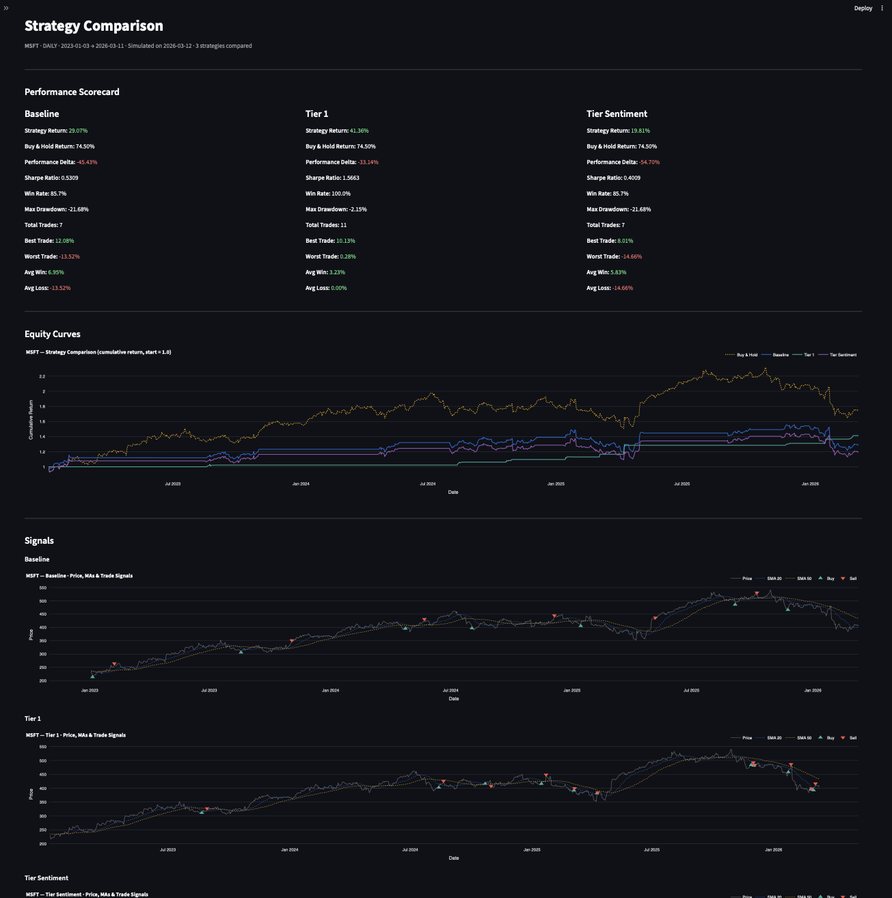

# Quantitative Trading Engine

A systematic backtesting framework built on a medallion data architecture. Fetches historical price and news data, computes technical indicators and LLM-based sentiment, runs vectorized strategy backtests, and serves results through a FastAPI backend and Streamlit dashboard.



## Architecture

```
trading_engine/
├── .venv
├── .gitignore
├── requirements.txt
├── readme.md
│
├── data/
│   ├── bronze/        # Raw OHLCV + news (parquet)
│   ├── silver/        # Featured: indicators + sentiment (parquet)
│   └── gold/          # Backtest results per strategy (parquet + JSON)
│
└── src/
    ├── frontend/
    │   ├── app.py         # Streamlit dashboard
    │   └── charts.py      # Plotly figure builders
    │
    └── backend/
        ├── api.py                   # FastAPI server
        ├── config.py                # API keys and settings
        ├── utils.py                 # Calendar routing, parquet helpers
        │
        ├── pipeline/
        │   ├── orchestrator.py      # Entry point: bronze → silver → gold
        │   ├── engine_backtest.py   # Vectorized backtest engine
        │   ├── bronze_pipeline.py   # Delta fetch orchestration
        │   └── silver_pipeline.py   # Indicator + sentiment orchestration
        │
        ├── data_processor/
        │   ├── prices_fetcher.py    # yfinance OHLCV fetch + store
        │   ├── news_fetcher.py      # Alpaca news fetch + store
        │   ├── fetcher_utils.py     # Shared delta detection + upsert
        │   ├── indicators.py        # RSI, SMA, EMA, MACD
        │   ├── sentiment.py         # LLM daily sentiment scoring
        │   └── data_eraser.py       # Cache management utility
        │
        └── trading_strategy/
            ├── registry.py          # Strategy registry
            ├── baseline.py          # RSI mean reversion (35/65)
            ├── tier1.py             # Trend-confirmed RSI mean reversion with strict +2% profit and -1% stop-loss exits
            └── tier_sentiment.py    # Dynamic RSI mean-reversion adjusted by LLM-scored news sentiment outputting a score from -1.0 (Panic) to +1.0 (Euphoria)
```

---

## Data Pipeline

Each run checks what data already exists and fetches only the delta. The three tiers are always processed in order.

```
Bronze  →  Silver  →  Gold
 fetch       indicators    backtest
 & store     sentiment     & metrics
```

**Bronze** — `prices_fetcher` pulls OHLCV from yfinance; `news_fetcher` pulls headlines from Alpaca. Both use `fetcher_utils.get_fetch_range()` to detect the last recorded date and fetch only missing rows.

**Silver** — `indicators.py` computes RSI (22), SMA (20, 50), EMA (20), and MACD. `sentiment.py` scores each trading day's headlines via `gpt-4o-mini`, with delta logic so only new dates are sent to the LLM. A lookback window primes the math correctly on incremental runs.

**Gold** — the backtest engine reads silver, applies a strategy from the registry, and writes three files per strategy: `_dataset.parquet` (full timeseries), `_trades.parquet` (trade log), `_metrics.json` (performance summary).

---

## Performance Metrics

Our engine evaluates every strategy using institutional-grade quantitative metrics:

#### **Returns & Alpha**
* **Strategy Return:** Cumulative percentage gain generated by the algorithm.
* **Buy & Hold Return:** Total return of the underlying asset (Passive Benchmark).
* **Performance Delta:** The "Alpha" generated (Strategy Return minus Benchmark).

#### **Risk & Efficiency**
* **Sharpe Ratio:** Risk-adjusted return; calculates excess return per unit of volatility.
* **Max Drawdown:** The largest peak-to-trough decline; represents historical maximum risk.

#### **Trade Execution Quality**
* **Win Rate:** Percentage of trades closed with a profit.
* **Total Trades:** Total count of completed buy/sell cycles.
* **Best/Worst Trade:** The highest and lowest individual trade percentage returns.
* **Avg Win/Loss:** The mean performance of profitable vs. unprofitable trades.

---

## Setup

```bash
# 1. Create and activate virtual environment
python -m venv .venv
source .venv/bin/activate        # Windows: .venv\Scripts\activate

# 2. Install dependencies
pip install -r requirements.txt

# 3. Install the project as an editable package (fixes all imports)
pip install -e .

# 4. Add API keys
cp src/backend/.env.example src/backend/.env
# Fill in: ALPACA_API_KEY, ALPACA_SECRET_KEY, OPENAI_KEY
```

---

## Running

**API server** (required for the dashboard):
```bash
cd src/backend
uvicorn api:app --reload
# → http://localhost:8000
```

**Streamlit dashboard:**
```bash
cd src/frontend
streamlit run app.py
# → http://localhost:8501
```

**CLI:**
```bash
cd src/backend
python cli_demo.py
```

---

## Adding a Strategy

1. Create `src/backend/trading_strategy/tier3.py` with a `generate_signals_tier3(df) -> df` function that adds `Signal` and `Position` columns
2. Register it in `registry.py`:

```python
from .tier3 import generate_signals_tier3

STRATEGIES = {
    "baseline":       generate_signals_baseline,
    "tier_1":         generate_signals_tier1,
    "tier_sentiment": generate_signals_sentiment
    "tier_3":         generate_signals_tier3,   # ← add here
}
```

The strategy will automatically appear in the next comparison run — no other files need to change.

---

## API

| Method | Endpoint | Description |
|--------|----------|-------------|
| `POST` | `/api/v1/compare` | Run all strategies on a ticker |
| `POST` | `/api/v1/backtest` | Run a single strategy |

**Compare payload:**
```json
{
  "ticker": "NVDA",
  "interval": "daily",
  "start_date": "2023-01-01",
  "end_date": "2024-12-31"
}
```

---

## Dependencies

| Package | Purpose |
|---------|---------|
| `yfinance` | OHLCV price data |
| `alpaca-trade-api` | News headlines |
| `langchain-openai` | LLM sentiment scoring |
| `pandas` / `pyarrow` | Data processing and parquet I/O |
| `fastapi` / `uvicorn` | REST API server |
| `streamlit` | Dashboard UI |
| `plotly` | Interactive charts |